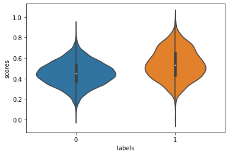
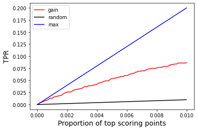
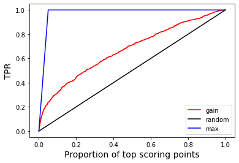

# AGC - Area under Gain Curves

In this notebook, we review the well known measures **AUC** (area under the ROC curve) and Average Precision (**AP**) used to compare binary classifiers. We then introduce the **[Normalized Truncated] Area under Gain Curves (AGC)** measure. This is illustrated via a small example.


```python
import numpy as np
import pandas as pd
from sklearn.metrics import roc_curve, roc_auc_score, precision_recall_curve, auc, average_precision_score

import matplotlib.pyplot as plt
%matplotlib inline
import seaborn as sns

# to install: pip install agc
from agc import * 

```

# Small random example

- We use this dataset to compare various measures
- **N = 20,000** points, with 5% positive labels
- slighlty higher average score for the positive labels


```python
## labels
N = 20000
N_pos = 1000
labels = np.concatenate((np.repeat(1,N_pos),np.repeat(0,N-N_pos)))

## scores
scores = np.concatenate((np.random.normal(.75,.1,N_pos//5),np.random.normal(.45,.15,N_pos-N_pos//5),
                         np.random.normal(.4,.15,N-N_pos)))
## clumping
m = np.min(scores)
M = np.max(scores)
scores = [(i-m)/(M-m) for i in scores]
#scores = [min(1,i) for i in scores]
#scores = [max(0,i) for i in scores]

## plot
D = pd.DataFrame()
D['labels']=labels
D['scores']=scores
ax = sns.violinplot(x="labels", y="scores", data=D)
```


    

    


# ROC and AUC

For a given threshold T, we label points with score T or more as positives, and the other points as negatives. When comparing with ground truth, we define:

- TP, FP, TN, FN: respectively the number of true positives, false positives, true negatives and false negatives
- TruePositiveRate: TPR = TP/(TP+FN)
- FalsePositiveRate: FPR = FP/(FP+TN)

A ROC curve is obtained by plotting TPR vs FPR for all possible thresholds T. Then AUC is the area under the ROC curve obtained via the trapezoidal rule. With a random classifier, the expected AUC is R(AUC) = 0.5, while the maximum value is M(AUC) = 1. A nice interpretation is that AUC = Pr(score of random positive case > score of random negative case). Therefore, one can easily approximate AUC even for huge datasets by sampling (with replacement) from positive cases, sampling (with replacement) negative cases and compare the samples.

We define the **normalized AUC** as AUC' = (AUC - R(AUC))/(M(AUC) - R(AUC)) = 2 x AUC - 1, so AUC' is the proportion of potential improvement over random that we achieved; this can be negative is we do worse than random.

In the cells below, we copmpute AUC and AUC' for the example defined before, and we show the ROC curve along with the maximum and random curves.


```python
## compute AUC
fpr, tpr, thresholds = roc_curve(np.array(labels), np.array(scores), pos_label=1)
AUC = roc_auc_score(np.array(labels), np.array(scores))
print('AUC=',AUC,'AUC\'=',(AUC-.5)/.5)
```

    AUC= 0.6797747368421052 AUC'= 0.3595494736842104


```python
## plot ROC
## AUC = "area under red curve"
## AUC'= ("area under red curve"-"area under black curve")/("area under blue curve"-"area under black curve")
plt.plot(fpr,tpr,color='red', label='ROC')
plt.plot([0,1],[0,1],color='black',label='random')
plt.plot([0,0,1],[0,1,1],color='blue',label='max')
plt.legend()
plt.xlabel('FPR',fontsize=14)
plt.ylabel('TPR',fontsize=14);
```


    

    


# Precision-recall (PR) curve and average precision (AP)

For a given threshold T, we define
* recall = TP/(TP+FN)
* precision = TP/(TP+FP)
When we plot precision vs recall, we can compute the area under the curve using the trapeziodal rule; this result is similar, but not identical to the average precision (AP), defined as:
* **AP** = $\sum_i (R_i-R_{i-1})P_i$ where the $R_i$ are the recall values at the various thresholds, and $P_i$ the corresponding precisions.

The maximum value for AP is 1, and the expected value under random classifier is the proportion of positive label points. We usually prefer using AP, as taking the area under the PR curve may be too optimistic. AP is generally preferable to AUC when dealing with **class imbalance**.

Below, we compute the area under the PR curve, the AP and we show the PR curve along with the maximum and random curves.


```python
## Compute area(PR) and AP
precision, recall, _ = precision_recall_curve(np.array(labels), np.array(scores), pos_label=1)
print('Area under curve:',auc(recall, precision))
print('Average precision:',average_precision_score(np.array(labels), np.array(scores), pos_label=1))
```

    Area under curve: 0.1763575078137854
    Average precision: 0.17687238899948507


```python
## plot PR curve in red; max in blue, rndom in black.
plt.plot(recall,precision,color='red',label='PR')
plt.xlabel('Recall',fontsize=14)
plt.ylabel('Precision',fontsize=14);
plt.plot([0,1],[N_pos/N,N_pos/N],color='black',label='random')
plt.plot([0,0,1],[0,1,1],color='blue',label='max')
plt.legend();

```


    

    


# Gain curves

For AUC or AP, we consider the entire curve. In practice, we may be **restricted** in terms of the number of points we can look at, so we want as many positive cases to score high, say in the **top-k** or the **top (100*q)%**.

We can look at the precision for the top-k, but this neglects the ordering. One alternative is to look at **gain** curves. Let N be the total number of data points. We plot a gain curve by plotting: 

- for the x-axis: (TP+FP)/N, the proportion of points at or above the threshold, and
- for the y-axis: TPR.

Thus, is is simple to **truncate** a gain curve by looking only at the top scoring points as we show below.

In the next cells, we plot the gain curve for the same example, first for the entire dataset, next for the top scoring 10% and 1% points respectively. As before, the maximum curve is shown in blue, and random curve in black. 


```python
## plot gain curve as well as max and (expected) random curves
top, tpr, _ = gain_curve(y_true=labels, y_score=scores, pos_label=1, truncate=1)
plt.plot(top,tpr,'red',label='gain')
plt.plot([0,1],[0,1],color='black',label='random') ## random
r = N_pos/N ## proportion of positives overall
plt.plot([0,r,1],[0,1,1],color='blue',label='max'); ## max
plt.legend()
plt.xlabel('Proportion of top scoring points',fontsize=14)
plt.ylabel('TPR',fontsize=14);
```


    

    


```python
## partial gain curve - truncate at 10%
trunc = .1
top, tpr, _ = gain_curve(y_true=labels, y_score=scores, pos_label=1, truncate=trunc)
plt.plot(top,tpr,'red',label='gain')
plt.plot([0,trunc],[0,trunc],color='black',label='random') ## random
r = N_pos/N ## proportion of positives overall
if r <= trunc:
    plt.plot([0,r,trunc],[0,1,1],color='blue',label='max') ## max
else:
    plt.plot([0,trunc],[0,N*trunc/N_pos],color='blue',label='max');
plt.legend()
plt.xlabel('Proportion of top scoring points',fontsize=14)
plt.ylabel('TPR',fontsize=14);
```


    

    


```python
## partial gain curve - truncate at 1%
trunc = .01
top, tpr, _ = gain_curve(y_true=labels, y_score=scores, pos_label=1, truncate=trunc)
plt.plot(top,tpr,'red',label='gain')
plt.plot([0,trunc],[0,trunc],color='black',label='random') ## random
r = N_pos/N ## proportion of positives overall
if r <= trunc:
    plt.plot([0,r,trunc],[0,1,1],color='blue',label='max') ## max
else:
    plt.plot([0,trunc],[0,N*trunc/N_pos],color='blue',label='max');
plt.legend()
plt.xlabel('Proportion of top scoring points',fontsize=14)
plt.ylabel('TPR',fontsize=14);
```


    

    


# AGC - area under the gain curve

Everything so far is well known; we now introduce the **truncated** score based on gain curves. Consider the normalized area under the gain curve

**AGC'(k) = (AGC(k) - R(AGC(k)))/(M(AGC(k)) - R(AGC(k)))**

where k is the number of top-scoring points considered, R() in the expected area given a random classifier and M() is the area under the best possible curve. 

The following function (in the **agc** package) is used to compute AGC or AGC':

```agc_score(y_true, y_score, pos_label=1, sample_weight=None, truncate=1, normalized=True)```
* *y_true*: ground-truth labels
* *y_score*: scores from some classifier
* *pos_label*: value indicating a positive label; all other values are considered negative
* *sample_weight*: can be defined to put different weights on the data points
* *truncate*: some integer $k>1$ to consider only the top-k points, or a value $0< k \le 1$, the proportion of top-scoring points to consider (value will be rounded).

Unlike AUC, the maximum value M(AGC)<1, so for the un-normalized area, we return AGC/M(AGC) so a perfect ordering yields a value of 1.

**Proposition**: AGC'(1) = AUC', i.e. when no truncation is done.

[Reference]: Lloyd, Chris J. A Note on the Area under the Gains Chart. International Journal of Statistics in Medical Research, 2018, vol. 7, no 3, p. 66-69.


## Truncated AGC

In the next cell, we verity the proposition above. Next, we compute AGC'(k) for a few values of k.


```python
## Recall tht AGC' = AUC' when no truncation is done, let's check
print("AGC':",agc_score(y_true=labels, y_score=scores, pos_label=1))
print("AUC':",(AUC-.5)/.5)
```

    AGC': 0.35954947368421053
    AUC': 0.3595494736842104


```python
## AGC with truncation to top 10%, 1% and 200 (same as 1%)
print("AGC'(.1):",agc_score(y_true=labels, y_score=scores, pos_label=1, truncate=.1))
print("AGC'(.01):",agc_score(y_true=labels, y_score=scores, pos_label=1, truncate=.01))
print("AGC'(200):",agc_score(y_true=labels, y_score=scores, pos_label=1, truncate=200))

```

    AGC'(.1): 0.237835
    AGC'(.01): 0.47560526315789475
    AGC'(200): 0.47560526315789475


## Weighted dataset

Recall that we have the option of using different weights for the data points; by default, all points have unit weight. In the cells below, we add random weights to all datapoints for illustration purpose.


```python
## generate random weights 
W = 1+np.random.exponential(1,size=len(labels))

## compute weighted AUC and AUC'
AUC = roc_auc_score(np.array(labels), np.array(scores), sample_weight=np.array(W))
print('AUC=',AUC,'AUC\'=',(AUC-.5)/.5)
```

    AUC= 0.6787362723204463 AUC'= 0.3574725446408926


For weighted datasets, we can also sample to estimate AUC, but we need to take weighted sample.

- AUC = Pr(score for weighted sampled positive point > score for weighted sampled negative point)


```python
## sample size
sample_size = 2000 ## 10%
## recall - first N_pos points are positive
w_pos = W[:N_pos]/np.sum(W[:N_pos])
w_neg = W[N_pos:]/np.sum(W[N_pos:])
s_pos = [scores[i] for i in np.random.choice(N_pos,size=sample_size,replace=True,p=w_pos)]
s_neg = [scores[i] for i in N_pos+np.random.choice(N-N_pos,size=sample_size,replace=True,p=w_neg)]
print('AUC approximation:',sum(np.array(s_pos)>np.array(s_neg))/sample_size)
```

    AUC approximation: 0.6935


We can also compute AGC with those weights; recall that AUC'=AGC'.


```python
## weighted AGC and AGC'
print('AGC = ',agc_score(labels, scores, sample_weight=W, normalized=False))
## weighted AGC' (same as AUC')
print("AGC'= ",agc_score(labels, scores, sample_weight=W, normalized=True))

```

    AGC =  0.6868555489814436
    AGC'=  0.3574725446408929


## Tied scores

So far all scores are distinct; all computation still work with ties in scores, which we illustrate below by truncating the scores.


```python
## force some ties
sc = [int(x*1000)/1000 for x in scores]
print('there are',len(np.unique(sc)),'distinct scores out of',len(sc))

## unweighted AUC/AGC
print('\nunweighted results')
AUC = roc_auc_score(np.array(labels), np.array(sc))
print('AUC =',AUC,'AUC\'=',(AUC-.5)/.5)
## weighted AGC
print('AGC =',agc_score(labels, sc, normalized=False),
      "AGC'=",agc_score(labels, sc, normalized=True))

## weighted AUC/AGC, same random weights as above
print('\nweighted results')
AUC = roc_auc_score(np.array(labels), np.array(sc), sample_weight=np.array(W))
print('AUC =',AUC,'AUC\'=',(AUC-.5)/.5)
## weighted AGC
print('AGC =',agc_score(labels, sc, sample_weight=W, normalized=False),
      "AGC'=",agc_score(labels, sc, sample_weight=W, normalized=True))

```

    there are 757 distinct scores out of 20000
    
    unweighted results
    AUC = 0.6797642105263157 AUC'= 0.3595284210526315
    AGC = 0.6879753846153847 AGC'= 0.35952842105263155
    
    weighted results
    AUC = 0.6787461518138207 AUC'= 0.3574923036276414
    AGC = 0.6868651787910439 AGC'= 0.3574923036276421


## To normalized or not to normalize 

We recommend using the normalized area, and here is an illustration justifying this choice. Using the same example as before, we compare AGC for the whole curve and the top 1%, both in normalized and un-normalized cases. In the normalized case, the conclusion is that we do better early on than overall, which is to be expected in view of the distribution for the positive case. However, in the un-normalized case, the conclusion is the opposite ...

Looking at the curves once again, we see that for area under the black curve (random case) has a huge impact on the computation for AGC when looking at the whole dataset, but the impact is much less for the top 1%.
With the normalized version, we report the proportion of possible gain achieved over random, which we can naturally compare at various truncations.


```python
## normalized agc, all data and top 1%
print('normalized AGC(1) = ',agc_score(labels, scores, normalized=True, truncate=1))
print('normalized AGC(.01) = ',agc_score(labels, scores, normalized=True, truncate=.01))
## un-normalized agc, all data and top 1%
print('un-normalized AGC(1) = ',agc_score(labels, scores, normalized=False, truncate=1))
print('un-normalized AGC(.01) = ',agc_score(labels, scores, normalized=False, truncate=.01))
```

    normalized AGC(1) =  0.35954947368421053
    normalized AGC(.01) =  0.47560526315789475
    un-normalized AGC(1) =  0.687985641025641
    un-normalized AGC(.01) =  0.501825


```python
## plot gain curve as well as max and (expected) random curves
top, tpr, _ = gain_curve(y_true=labels, y_score=scores, pos_label=1, truncate=1)
plt.plot(top,tpr,'red',label='gain')
plt.plot([0,1],[0,1],color='black',label='random') ## random
r = N_pos/N ## proportion of positives overall
plt.plot([0,r,1],[0,1,1],color='blue',label='max'); ## max
plt.legend()
plt.xlabel('Proportion of top scoring points',fontsize=14)
plt.ylabel('TPR',fontsize=14);
```


    

    


```python
## partial gain curve - truncate at 1%
trunc = .01
top, tpr, _ = gain_curve(y_true=labels, y_score=scores, pos_label=1, truncate=trunc)
plt.plot(top,tpr,'red',label='gain')
plt.plot([0,trunc],[0,trunc],color='black',label='random') ## random
r = N_pos/N ## proportion of positives overall
if r <= trunc:
    plt.plot([0,r,trunc],[0,1,1],color='blue',label='max') ## max
else:
    plt.plot([0,trunc],[0,N*trunc/N_pos],color='blue',label='max');
plt.legend()
plt.xlabel('Proportion of top scoring points',fontsize=14)
plt.ylabel('TPR',fontsize=14);
```


    

    


## Why not truncate AUC or AP?

For AUC, it is quite clear that truncating to the top-k points is problematic, since the x-axis is the FPR. For example, if all top-k points are positives (a great result!), then the area is 0 ... If the first k/2 points are negatives followed by k/2 positives, we still have area 0 ... 

For AP, the x-axis are the recall values, so we can only truncate at threshold point that have at least a positive case. Let's see this via a simple example. We look at AP for the first 10 points. Consider 2 cases for the ranking (from high to low scores, no ties):
* 10 positives: AP(10) = 1 (precision of 1 everywhere)
* 3 positive followed by 7 negatives: AP(10) = 1 (since recall only changes at the first 3 points)

We look at a larger example below. We consider N = 1000 points, 100 of which are positives. We look at the top-50, which contains 25 positives. For the top-50, given x $\in \{0,1,...,25\}$, we set the top x points and the bottom 25-x points as positives, and the rest as negatives. We compare the (normalized) AP with the normalized AGC. Normalization for AP is done in the same way we already described. We clearly see that AP is being overly optimistic, not only in the extreme case where all 25 positives in the top-50 are ranked first, but overall.


```python
## AP' for top-k
from sklearn.metrics import precision_recall_curve as prc
def normalized_AP(y_true, y_score, truncate):
    precision, recall, thresholds = prc(y_true, y_score)
    th = y_score[truncate-1]
    b = thresholds >= th
    AP = sum([precision[i]*(recall[i]-recall[i+1]) for i in range(len(b)) if b[i]])
    M = sum([(recall[i]-recall[i+1]) for i in range(len(b)) if b[i]])
    R = sum(y_true)/len(y_true)*M
    if M>0:
        return (AP-R)/(M-R)
    else:
        return None

## experiment described above
n = 1000
pos = 100
k = 50
k_pos = 25
proba = np.linspace(1,0,n) ##  decreasing scores
L = []
for a in np.arange(0,k_pos+1):
    ## init
    y_true = np.repeat(0,n)
    ## k_pos in top k according to 'a'
    for i in range(a):
        y_true[i]=1
    for i in range(k-1,k-1-(k_pos-a),-1):
        y_true[i]=1
    ## pos-k_pos in bottom (n-k) at random
    for i in np.random.choice(n-k, pos-k_pos, False):
        y_true[i+k] = 1
    ap = normalized_AP(y_true, proba, truncate=k)
    agc = agc_score(y_true, proba, truncate=k)
    L.append([a,ap,agc])

## plotting
D = pd.DataFrame(L, columns=['top-positives','AP','AGC'])
plt.plot(D['top-positives'],D['AP'],label="AP'")
plt.plot(D['top-positives'],D['AGC'],label="AGC'")
plt.xlabel('# positives ranked first (in top-50, out of 25)')
plt.ylabel('truncated normalized score')
plt.legend();

    
```


    

    

